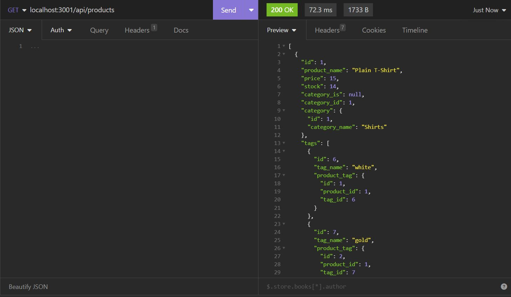
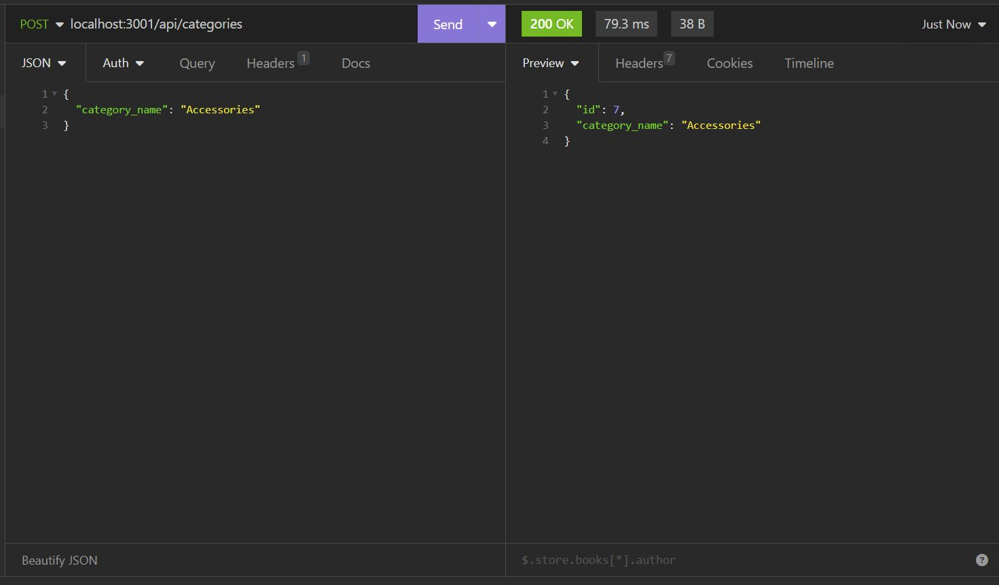
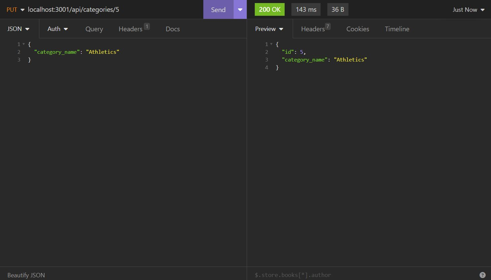
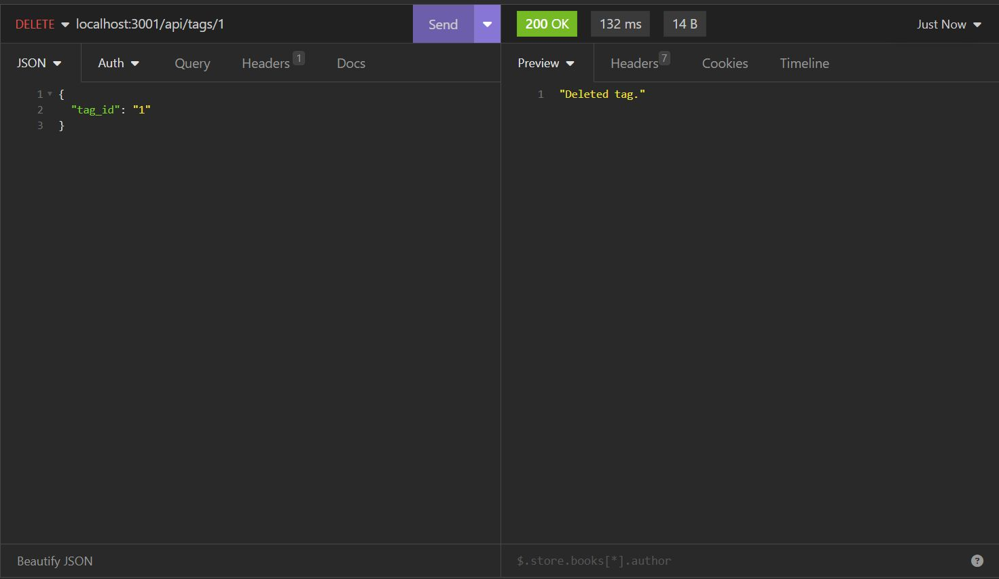

# Sequlized Web Shop

## Description
This application is a back end for an e-commerce site. You use an Express.js API and configure it to use Sequelize to interact with a MySQL database. 

## Table of Contents
- [Installation](#installation)
- [Usage](#usage)
- [Video](#video)
- [Screenshots](#Screenshots)
- [Credits](#credits)
- [Tests](#tests)
- [License](#license)

## Installation
Clone the repository: **git clone https://github.com/Firene11/Sequelized-Web-Shop.git**

Open VSCode (or similar) and add your MySQL username and password to the environment variable file (.env) and you will be able to connect to a database using Sequelize.

## Usage

When you enter schema and seed commands, a development database is created and is seeded with test data.

From the command line in your terminal run the commmand:

**npm run seed** to seed the database

When you enter the command to invoke the application, the server is started and the Sequelize models are synced to the MySQL database.

**node server.js** to listen to the PORT

When you open API GET routes in Insomnia Core for categories, products, or tags, Then the data for each of these routes is displayed in a formatted JSON.

When you test API POST, PUT, and DELETE routes in Insomnia Core, you are able to successfully create, update, and delete data in the database.

**https://insomnia.rest/**

Choose an option from the list to view specific information from the employee database. Once you view the data, you are immediately able to choose another option. 

## Video

**Watch this VIDEO to see how the app runs!**

https://drive.google.com/file/d/1WfkFoGu-8o8E5m4yCyRcSVpQEscQN3mi/view

## Screenshots

 
 
 
 

## Credits
n/a

## Tests

https://insomnia.rest/
